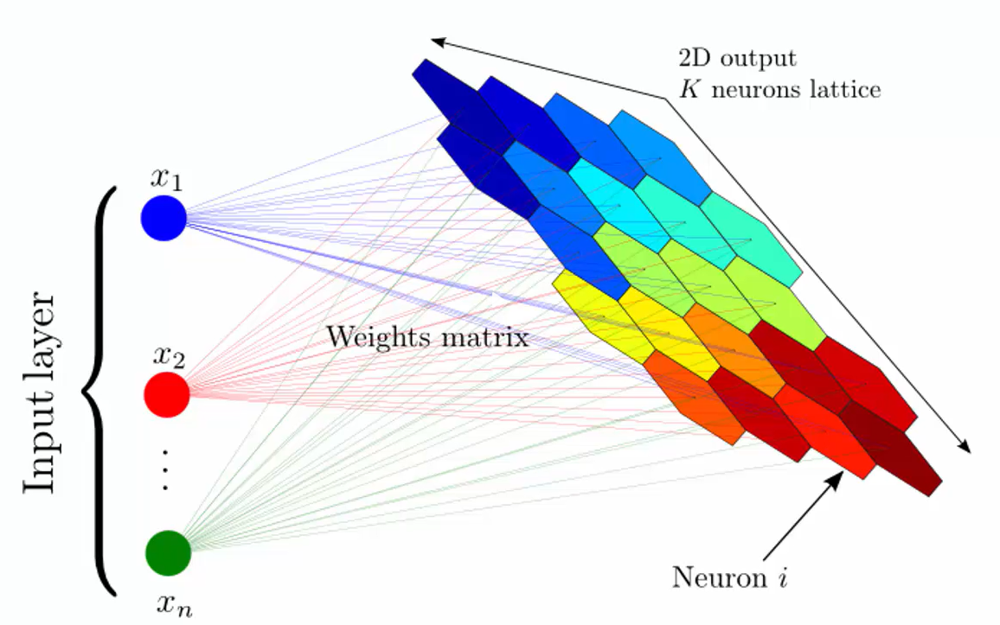
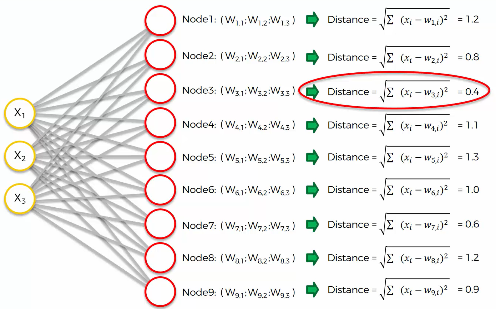
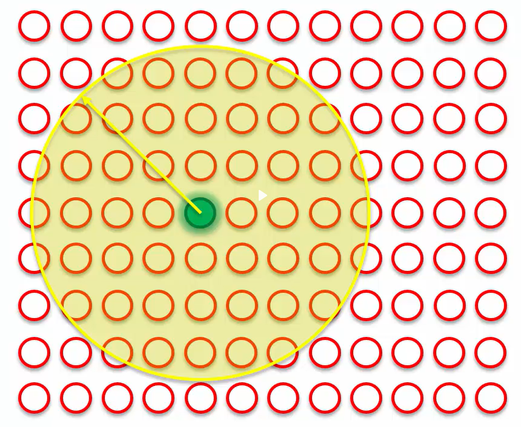

# Self-Organizing Maps (SOMs)

# What are SOMs?
* **Used for Feature Detection on Unstructured Data:**
  * SOMs are particularly useful for identifying patterns and features in unstructured data, which can include text, images, or other non-tabular data.
  
* **Reducing Dimensionality in Your Data:**
  * SOMs help in reducing the dimensionality of large datasets, making it easier to visualize and analyze high-dimensional data by mapping it onto a lower-dimensional (usually two-dimensional) grid.

## K-Means Clustering
Before I show how SOMs learn. Lets revisit the steps of how K-Means Clustering works.

### Revisting K-Means Clustering
KMeans Clustering Steps:
1. **Choose the number of K clusters**: Determine the optimal number of clusters (K) using the Elbow method or another heuristic.
2. **Select random K points as centroids**: Initialize K centroids randomly.
3. **Assign each data point to the closest centroid**: Form K clusters by assigning each data point to its nearest centroid.
4. **Compute new centroids**: Calculate the mean of the data points in each cluster to find the new centroid.
5. **Reassign data points**: Reassign each data point to the new closest centroid. Repeat steps 4 and 5 until the centroids no longer change significantly.

# How Do SOMs Learn?
* **Weights in SOMs vs. Other Neural Networks:**

  * In Self-Organizing Maps (SOMs), weights are different from those in other neural networks like ANNs and CNNs.
  * Weights in SOMs represent the characteristics of each neuron (the data for column 1, column 2, column 3, etc.).

* **Function of Weights:**

  * The output node contains weights that act as coordinates in the input space.
When an input node is presented, the output node uses its weights to determine how well it matches the input data.
The goal is to adjust these weights so that the output node finds the best position in the input space relative to the input data.

* **Best Matching Unit (Bmu)**
  * Now we're going to have a competition among these nodes and go through each of our rows of our dataset and we're going to find out which of these nodes is closest to each of our rows in our dataset.
  * Lets assume node 3 matched row 1 of our data best so it's now our best match unit (BmU) for row one of our data.
  

  * Neighborhood Update:
    * This point will be dragged closer to row 1 and the other neurons within this ratio will also be dragged closer to row 1. This process continues and the SOM is self organizing itself to where the final output will be a reflection of that is the correct structure of the input data.

### Important To Know For SOMs:
1.) SOMs retain topology of the input

2.) SOMS reveal correlations that are not easily identified

3.) SOMs classify data without supervision

4.) No target vector --> no backpropagation done.

5.) No lateral connections between output nodes.
