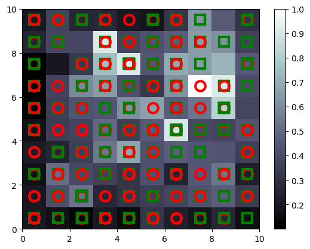
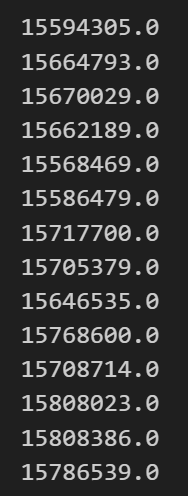

# Customer Segmentation Using Self-Organizing Maps (SOMs)


# What are SOMs?
* **Used for Feature Detection on Unstructured Data:**
  * SOMs are particularly useful for identifying patterns and features in unstructured data, which can include text, images, or other non-tabular data.
  
* **Reducing Dimensionality in Your Data:**
  * SOMs help in reducing the dimensionality of large datasets, making it easier to visualize and analyze high-dimensional data by mapping it onto a lower-dimensional (usually two-dimensional) grid.

## K-Means Clustering
Before I show how SOMs learn. Lets revisit the steps of how K-Means Clustering works.

### Revisting K-Means Clustering
KMeans Clustering Steps:
1. **Choose the number of K clusters**: Determine the optimal number of clusters (K) using the Elbow method or another heuristic.
2. **Select random K points as centroids**: Initialize K centroids randomly.
3. **Assign each data point to the closest centroid**: Form K clusters by assigning each data point to its nearest centroid.
4. **Compute new centroids**: Calculate the mean of the data points in each cluster to find the new centroid.
5. **Reassign data points**: Reassign each data point to the new closest centroid. Repeat steps 4 and 5 until the centroids no longer change significantly.

# How Do SOMs Learn?
* **Weights in SOMs vs. Other Neural Networks:**

  * In Self-Organizing Maps (SOMs), weights are different from those in other neural networks like ANNs and CNNs.
  * Weights in SOMs represent the characteristics of each neuron (the data for column 1, column 2, column 3, etc.).

* **Function of Weights:**

  * The output node contains weights that act as coordinates in the input space.
When an input node is presented, the output node uses its weights to determine how well it matches the input data.
The goal is to adjust these weights so that the output node finds the best position in the input space relative to the input data.

* **Best Matching Unit (Bmu)**
  * Now we're going to have a competition among these nodes and go through each of our rows of our dataset and we're going to find out which of these nodes is closest to each of our rows in our dataset.
  * Lets assume node 3 matched row 1 of our data best so it's now our best match unit (BmU) for row one of our data.
  


  * Neighborhood Update:
    * This point will be dragged closer to row 1 and the other neurons within this ratio will also be dragged closer to row 1. This process continues and the SOM is self organizing itself to where the final output will be a reflection of that is the correct structure of the input data.


### Important To Know For SOMs:
1.) SOMs retain topology of the input

2.) SOMS reveal correlations that are not easily identified

3.) SOMs classify data without supervision

4.) No target vector --> no backpropagation done.

5.) No lateral connections between output nodes.

## Steps for Training an SOM Model

1. **Start with a dataset composed of n_features independent variables.**
   - Ensure your dataset is properly formatted and cleaned, with each observation containing `n_features` independent variables.

2. **Create a grid composed of nodes, each one having a weight vector of n_feature elements.**
   - Define the dimensions of the grid (e.g., 10x10) and initialize each node with a weight vector containing `n_feature` elements.

3. **Randomly initialize the values of the weight vectors to small numbers close to 0 but not 0.**
   - Initialize the weights of each node randomly, ensuring the values are small and close to 0, but not exactly 0.

4. **Select one random observation point from the dataset.**
   - Randomly pick an observation from your dataset to use in the training step.

5. **Compute the Euclidean distance from this point to the different neurons in the network.**
   - Calculate the Euclidean distance between the selected observation and the weight vectors of all neurons in the grid.

6. **Select the neuron that has the minimum distance to the point. This neuron is called the "Winning node" or Best Matching Unit (BMU).**
   - Identify the neuron with the smallest Euclidean distance to the observation. This neuron is the BMU.

7. **Update the weights of the winning node to move it closer to the point.**
   - Adjust the weights of the BMU to make them more similar to the selected observation.

8. **Using a Gaussian neighborhood function of mean centered on the winning node, also update the weights of the winning node neighbors to move them closer to the point. The neighborhood radius is the sigma in the Gaussian function.**
   - Apply a Gaussian function centered on the BMU to update the weights of the neighboring neurons, moving them closer to the selected observation.

9. **Repeat steps 4 to 8 and update the weights after each observation (Reinforcement Learning) or after a batch of observations (Batch Learning), until the network converges to a point where the neighborhood stops decreasing.**

# **Building a SOM in Python:**

## **Objective**
Detect potential fraud in credit card applications by identifying suspicious patterns in customer banking data.

Read in data and import packages:
```
# Import python packages:
import pandas as pd
import numpy as np
import seaborn as sns
import matplotlib.pyplot as plt
from sklearn.preprocessing import MinMaxScaler
from minisom import MiniSom
from pylab import bone, pcolor, colorbar, plot, show

# Import dataset:
df = pd.read_csv(r'Credit_Card_Applications.csv')
```

Feature Scaling:

```
# Split data to X and Y variables:
X = df.iloc[:, :-1].values
y = df.iloc[:, -1].values

# Instaniate MinxMax Scaler:
sc = MinMaxScaler(feature_range = (0, 1))
X = sc.fit_transform(X)
```

Training SOM:

```
# Training the SOM:
som = MiniSom(x = 10, y = 10, input_len = 15, sigma = 1.0, learning_rate = 0.5)

# Initalize weights for data (Step 3):
som.random_weights_init(X)

# Train Self Organizing Map Model: Set to 100 iterations
som.train_random(X, num_iteration=100)
```

Visualize Results: Mean Interneuron Distance (MID)
* The Mean Interneuron Distance (MID) of a specific winning node is the average distance of all the neurons surrounding the winning node within a neighborhood defined by our sigma parameter. The sigma parameter represents the radius of this neighborhood. A higher MID indicates that the winning node is farther away from its neighbors within the neighborhood. Essentially, the higher the MID, the more likely the winning node is an outlier. This is how we will determine potential fraud: nodes with a high MID are flagged as possible fraudulent activities.

* Red squares = customers who didn't get approval
* Green squares = customers who did get approval.
* Lighter the color, higher the potential of fraud.



**Model Output Analysis**:
* The red squares represent customers who did not get approval for their credit card applications.

* The green squares represent customers who did get approval.

* The background color indicates the potential for fraud, with lighter colors representing a higher potential for fraud.

* In areas where red and green squares overlap, especially on a lighter background, it suggests that both approved and non-approved applications share similar characteristics that are indicative of potential fraud. This indicates that some applications were flagged for potential fraud regardless of their approval status.

**Retrieve Fraud Customers:**
Lastly, we can extract from our model the customerIds flagged as fraud.

```
# Get the mappings of the input data to their winning nodes in the SOM
mappings = som.win_map(X)

frauds = np.concatenate((mappings[(9,7)], mappings[(7,8)]), axis = 0)
# Inverse scaling
frauds = sc.inverse_transform(frauds)

# Convert the frauds array into a DataFrame
fraud_df = pd.DataFrame(frauds, columns=df.columns[:-1])  # Use appropriate column names from your dataset

# Display the DataFrame
fraud_df['CustomerID']
```

